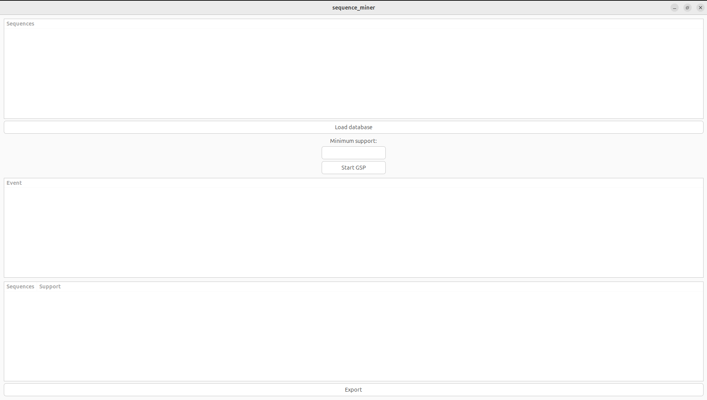
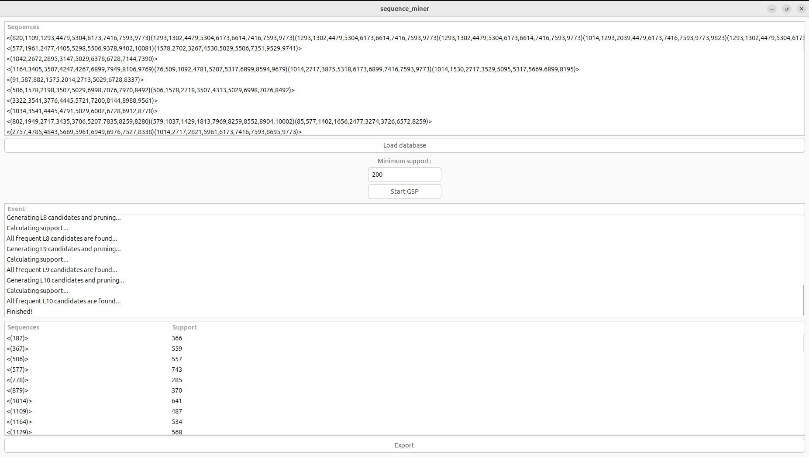

# GSP Algoritam - Sekvencijalno rudarenje podataka

Ovaj projekat predstavlja implementaciju **GSP (Generalized Sequential Pattern)** algoritma za pronalaženje učestalih sekvenci u bazama podataka transakcija. Program poseduje grafički korisnički interfejs (GUI) izrađen pomoću **GTK+ 3** biblioteke.


*Glavni korisnički interfejs - učitavanje baze i podešavanje parametara*

## 🚀 Funkcionalnosti

- **Učitavanje SPMF baza podataka**: Podržava standardni `.txt` format za rudarenje sekvenci.
- **Podešavanje parametara**: Korisnik može definisati minimalnu podršku (*Minimum Support*) direktno kroz GUI.
- **Multi-threading**: Algoritam se izvršava u zasebnoj niti kako bi GUI ostao responzivan tokom obrade velikih baza.
- **Interaktivni prikaz**: Rezultati se prikazuju u realnom vremenu unutar `TreeView` tabele sa indeksima.
- **SPMF Export**: Mogućnost čuvanja pronađenih sekvenci u `.txt` fajl kompatibilan sa SPMF formatom.


*Prikaz pronađenih učestalih sekvenci sa njihovom podrškom*

## 🛠 Tehnologije

- **Jezik**: C
- **GUI**: GTK+ 3.0 & Glade
- **Algoritam**: GSP (implementiran od nule)

## 📋 Preduslovi

Da biste pokrenuli ovaj program, potrebno je da imate instaliran GTK+ 3 razvojni paket.

**Ubuntu/Debian:**
```bash
sudo apt-get install libgtk-3-dev

